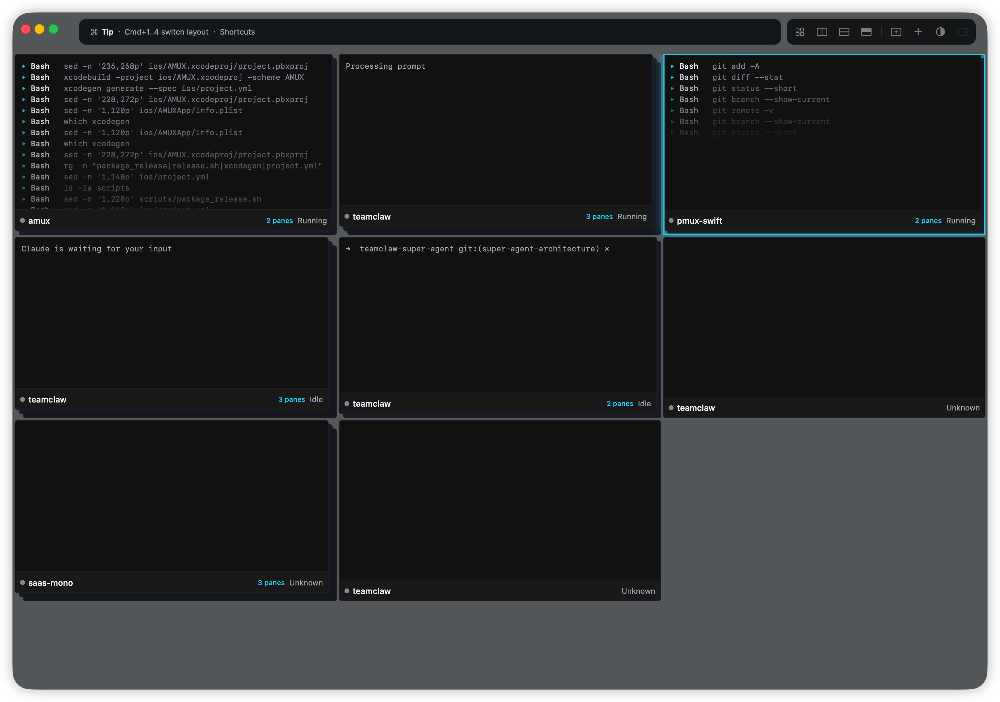
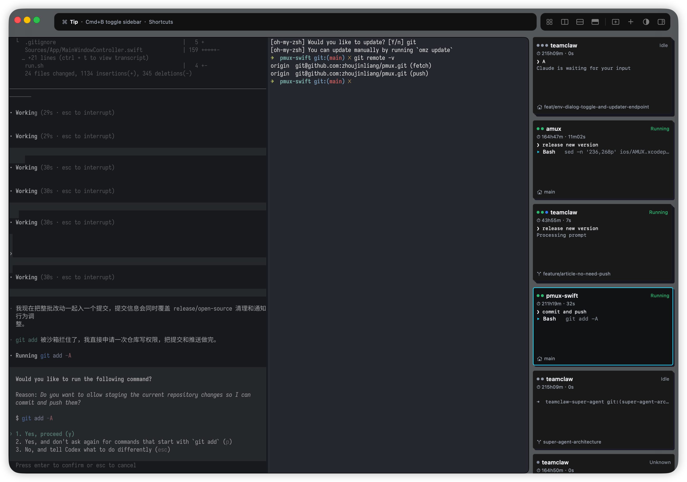
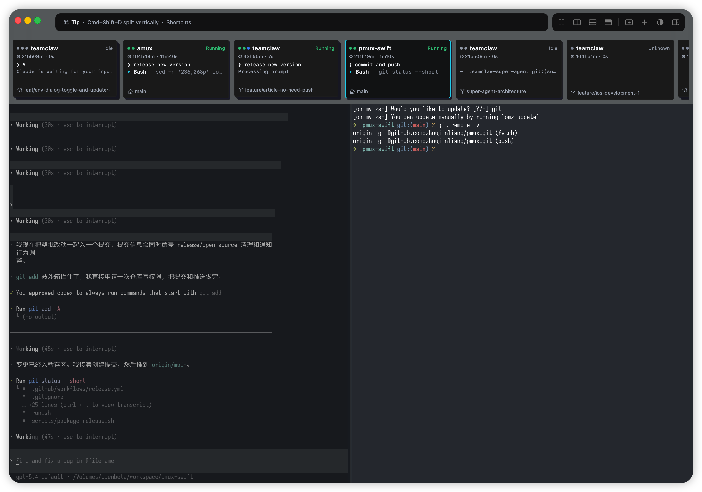
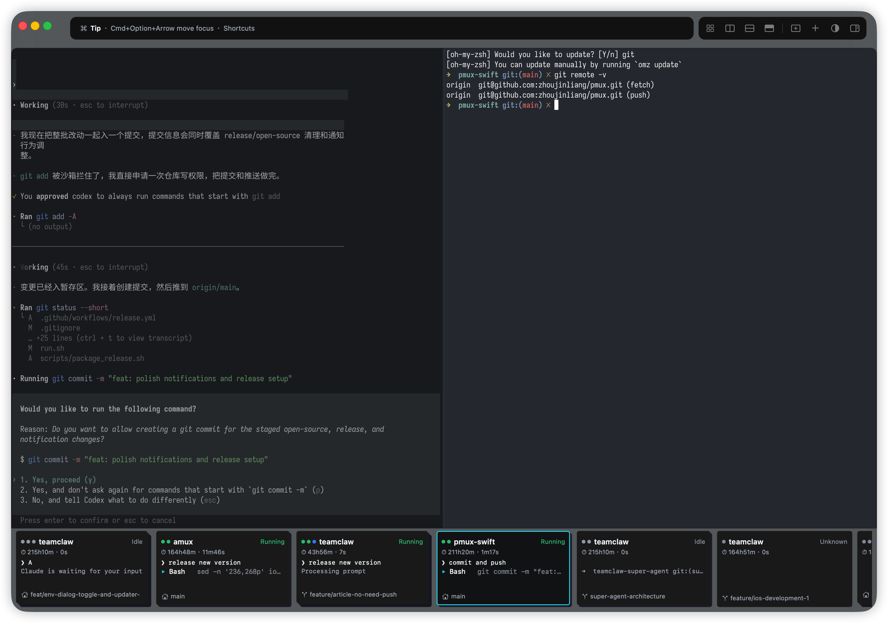

# amux

**A macOS workspace for coding agents, git worktrees, and parallel development.**

**一个为 coding agent、git worktree 和并行开发准备的 macOS 工作台。**

amux brings the moving parts of modern AI-assisted development into one place: repos, worktrees, panes, runs, prompts, and notifications.

当开发日常变成多个仓库、多个分支、多个 worktree、多个 agent 同时推进时，amux 用一个 macOS 界面把这些上下文整理到一起。

Download:
[`Apple Silicon`](https://github.com/BetaYao/pmux/releases/latest) · [`Intel`](https://github.com/BetaYao/pmux/releases/latest)

下载：
[`Apple Silicon`](https://github.com/BetaYao/pmux/releases/latest) · [`Intel`](https://github.com/BetaYao/pmux/releases/latest)

## Screenshots

### Dashboard



Your active worktrees, agents, and statuses, all visible at once.

一眼看到所有活跃的 worktree、agent 和状态，不再靠记忆切窗口。

### Focus Panel



Stay inside one worktree, split the view, and keep parallel tasks moving.

在一个 worktree 里深入推进任务，同时保留 split pane 的并行能力。

### Notification History



See what just happened and jump back into the right context immediately.

回看刚刚发生了什么，并快速跳回真正需要处理的现场。

### System Notification



Notifications stay tied to the actual work: result, target, and recent prompt.

通知不再只是“有事发生了”，而是明确告诉你结果、目标和对应 prompt。

## 中文

### 产品定位

amux 面向的是一种已经很常见的开发方式：

- 一个个终端窗口来回切
- 一堆 worktree 散落在 Finder 和 shell 里
- agent 在跑、在等、已经挂了，靠肉眼盯着看
- 收到通知时，只知道“有事发生了”，却不知道是哪一个 pane、哪一个分支、哪一次任务

你不缺终端，你缺的是一个能把这些终端、分支、agent 和状态组织起来的界面。

### 它是怎么工作的

amux 不打算替代终端。

它更像是给这套工作流补上一层产品化的操作界面：

- 你可以同时管理多个仓库和多个 git worktree
- 你可以在一个 worktree 里拆多个 pane，让多个 agent 并行推进
- 你可以更快看见谁在运行、谁在等你、谁已经完成、谁真的失败了
- 你可以从通知直接回到对应上下文，而不是重新找窗口、找 tab、找目录

重点不是把更多信息堆到屏幕上，而是让并行开发这件事变得更清楚、更轻松。

### 核心体验

- 原生 macOS 体验，不是 Electron 套壳
- 基于 Ghostty 的终端能力，保留终端工作流的速度和手感
- Dashboard 一屏总览所有 worktree、agent 和状态
- Focus Panel 支持 split pane，让一个 worktree 也能自然并行
- 通知按 pane 精确归因，不再是模糊的“某个任务完成了”
- Notification History 保留刚刚发生了什么，并支持快速跳回现场
- 适合 Claude Code、Codex 等 agent 并行使用

### 适合的人

- 重度使用 coding agent 的开发者
- 同时维护多个分支、多个 worktree 的个人和团队
- 已经把 AI 辅助编程放进日常工作流的人

### 为什么不是 Terminal + tmux

当然，你也可以继续用终端、tmux、worktree 和手动切换来管理一切。

但当任务开始并行、agent 开始增多、通知开始变得频繁时，纯命令行方案很快会暴露出几个问题：

- 状态是分散的，不是聚合的
- 通知是碎片化的，不是可导航的
- pane 在跑什么、哪个分支需要你、哪个任务刚结束，需要你自己拼上下文

amux 不是替代终端，而是让这套终端工作流更像一个完整产品，而不是一组零散工具。

### 下载

如果你只是想直接试用：

- 打开 GitHub Releases
- 下载对应架构的 `amux-macos-arm64.zip` 或 `amux-macos-x86_64.zip`
- 解压并启动应用

### 本地开发

本地构建：

```bash
xcodebuild -project amux.xcodeproj -scheme amux -configuration Debug build
```

运行 UI 测试：

```bash
./run_ui_tests.sh
```

打当前机器架构的 release 包：

```bash
./scripts/package_release.sh
```

产物会输出到 `dist/`。

### 发布

仓库已经包含 [`.github/workflows/release.yml`](.github/workflows/release.yml)。

- 推送 `v2.0.0` 这类 tag 会触发 release workflow
- workflow 会分别构建 `arm64` 和 `x86_64` 的 macOS 包
- 最终上传 `amux-macos-arm64.zip` 和 `amux-macos-x86_64.zip`

如果配置了下面这些 secrets，workflow 还会自动签名、notarize、staple：

- `APPLE_CERTIFICATE_P12`
- `APPLE_CERTIFICATE_PASSWORD`
- `APPLE_DEVELOPER_IDENTITY`
- `APPLE_ID`
- `APPLE_APP_SPECIFIC_PASSWORD`
- `APPLE_TEAM_ID`

### 发布流程

1. 更新 `project.yml` 里的版本号。
2. 提交并推送到默认分支。
3. 创建并推送 tag，比如 `git tag v2.0.0 && git push origin v2.0.0`。
4. 等待 `Release` workflow 完成。
5. 检查 GitHub Release 里的产物和说明。

## English

### Positioning

amux is built for a workflow that is becoming normal:

- too many terminal windows
- too many loose worktrees
- too many parallel agent runs with no clear status model
- too many notifications that tell you something happened, but not where or why

What used to be a few terminal tabs is now multiple repos, multiple worktrees, multiple agent runs, and constant context switching.

amux turns that into a workspace you can actually operate from.

### How It Works

- Native macOS app, built for speed and clarity
- Ghostty-backed terminal surfaces
- A dashboard that shows the real state of your active work
- Split panes inside a worktree so multiple agents can move in parallel
- Status aggregation that makes it easier to see what needs attention
- Notification history that lets you jump back into context
- System notifications tied to the actual target and recent prompt

### Who It Is For

- Developers already working with Claude Code, Codex, or similar coding agents
- People managing multiple branches and worktrees every day
- Teams using AI-assisted coding as part of regular development

### Why Not Terminal + tmux

You can keep using terminals, tmux sessions, worktrees, and manual context switching.

But once agent runs become parallel and notifications become constant, the cracks show:

- status is scattered instead of aggregated
- notifications are noisy instead of navigable
- context lives in your head instead of the interface

amux does not replace the terminal. It gives that workflow a cleaner surface to live in.

### Core Experience

It moves the experience from:

- scattered terminals to one workspace
- implicit status to visible status
- noisy notifications to actionable notifications
- single-threaded development to parallel execution

### Download

If you just want to try it:

- Open GitHub Releases
- Download `amux-macos-arm64.zip` or `amux-macos-x86_64.zip`
- Unzip it and launch the app

### Local Development

Build locally:

```bash
xcodebuild -project amux.xcodeproj -scheme amux -configuration Debug build
```

Run UI tests:

```bash
./run_ui_tests.sh
```

Build a release zip for the current machine architecture:

```bash
./scripts/package_release.sh
```

Artifacts are written to `dist/`.

### Releases

This repository includes [`.github/workflows/release.yml`](.github/workflows/release.yml).

- Pushing a tag like `v2.0.0` triggers the release workflow
- The workflow builds both `arm64` and `x86_64` macOS artifacts
- It publishes `amux-macos-arm64.zip` and `amux-macos-x86_64.zip` to the GitHub Release

If the following repository secrets are configured, the workflow will also sign, notarize, and staple the app:

- `APPLE_CERTIFICATE_P12`
- `APPLE_CERTIFICATE_PASSWORD`
- `APPLE_DEVELOPER_IDENTITY`
- `APPLE_ID`
- `APPLE_APP_SPECIFIC_PASSWORD`
- `APPLE_TEAM_ID`

### Release Process

1. Update the version in `project.yml`.
2. Commit and push to the default branch.
3. Create and push a tag, for example `git tag v2.0.0 && git push origin v2.0.0`.
4. Wait for the `Release` workflow to finish.
5. Verify the GitHub Release assets and notes.
